# SQL  
The lessons taught a lot about how to query a SQL database and add information to that database. It also taught how to create tables using SQL and the different data types, constraints, and defaults you can use.  

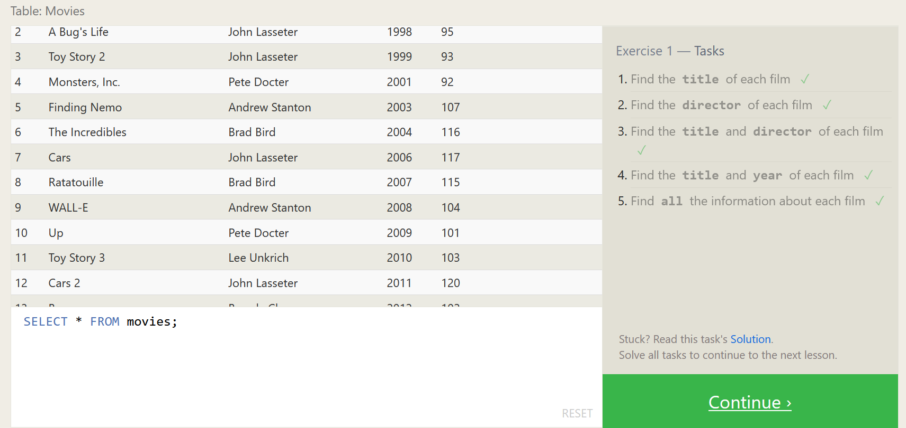
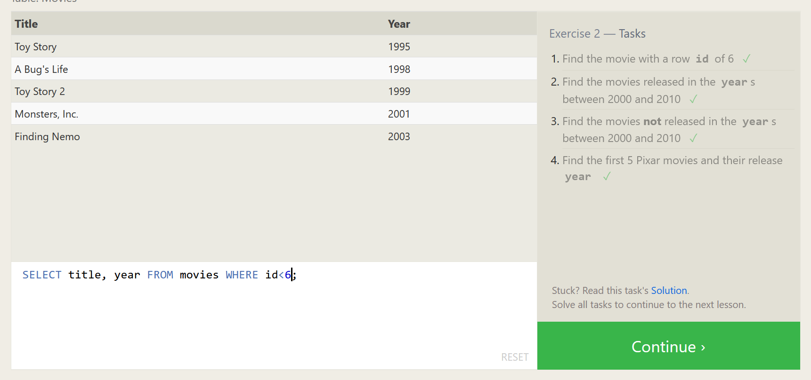
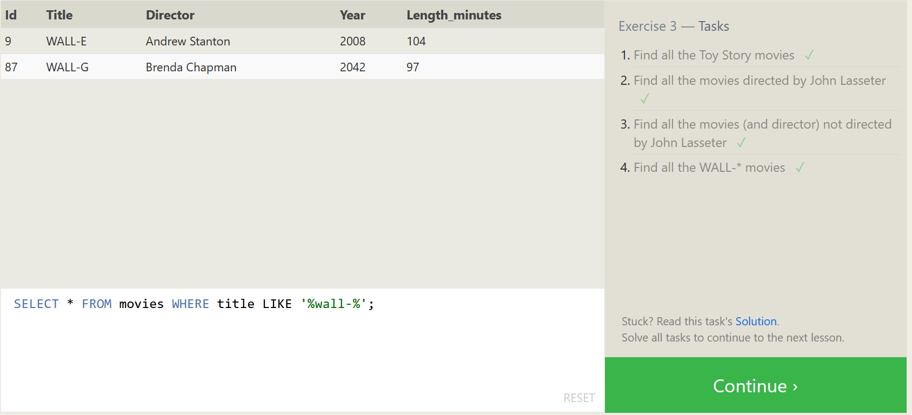
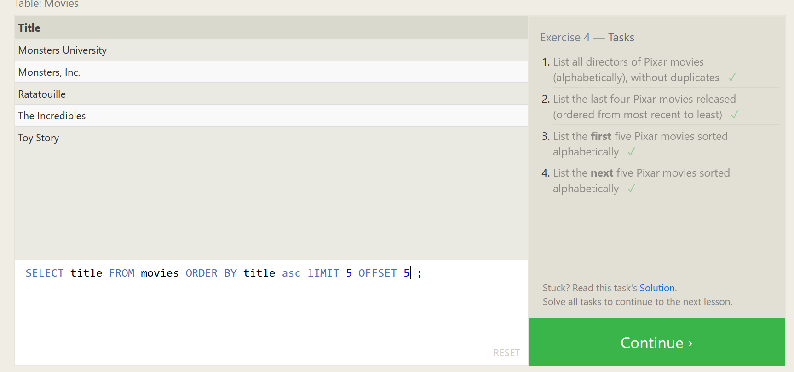
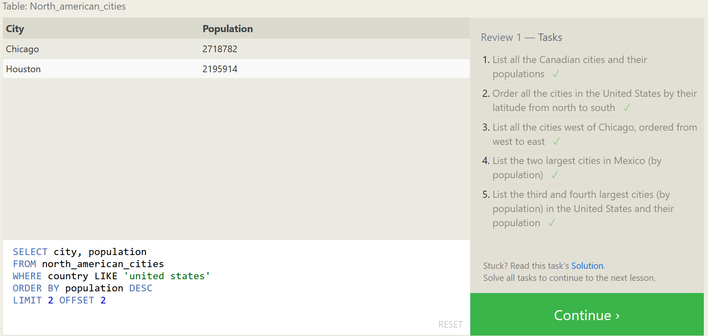
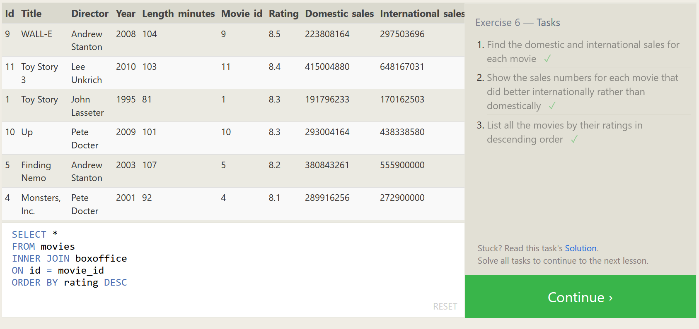
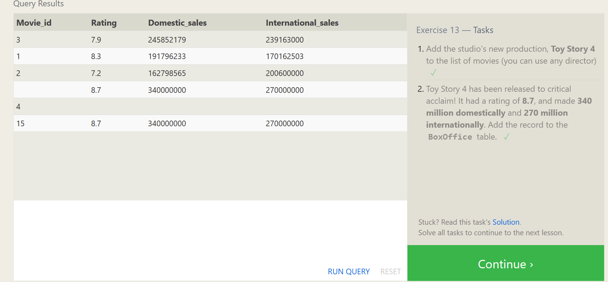
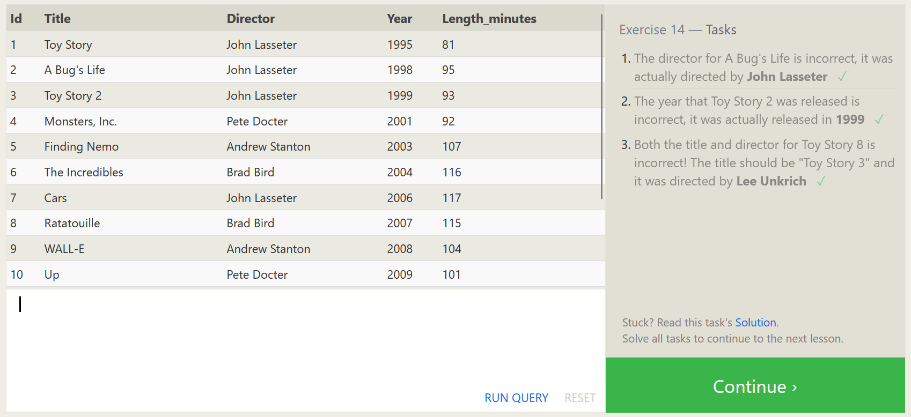
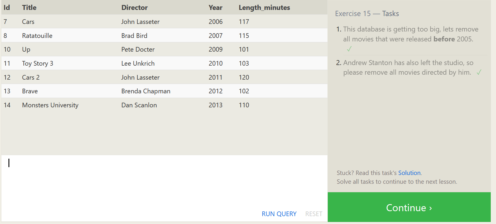
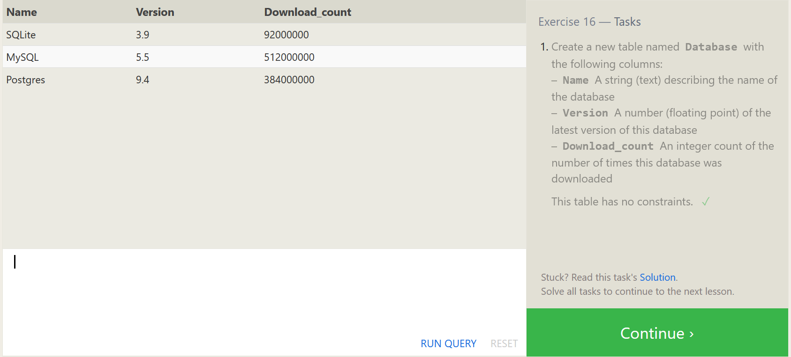
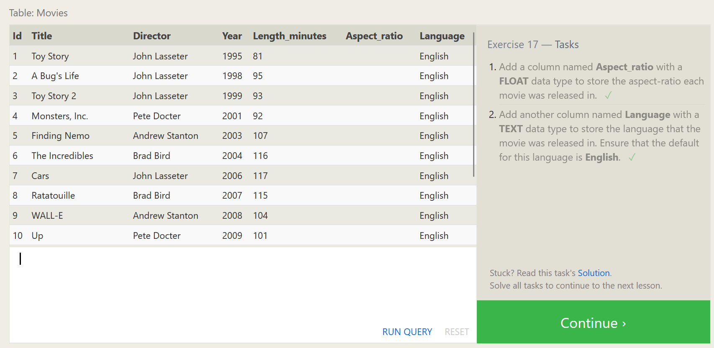
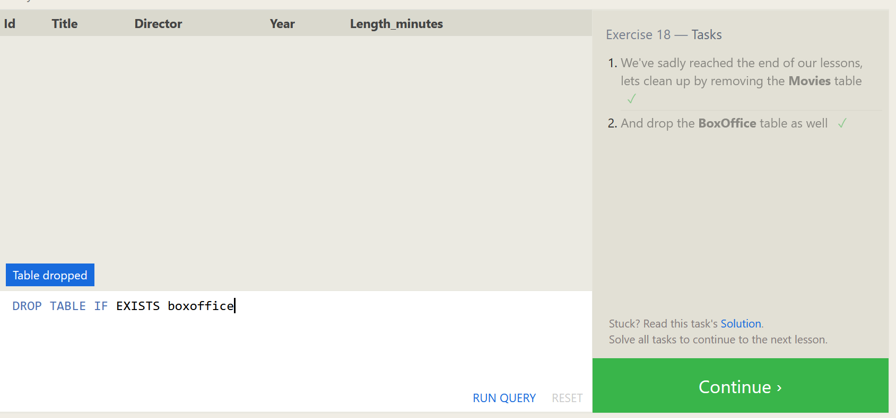